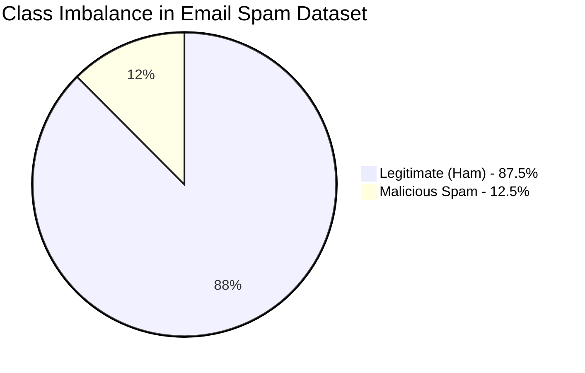

# Comprehensive Machine Learning Technical Report
## Domain: Email Spam Detection using Naive Bayes and Comparative Algorithms

---

### **Executive Summary**
This report presents an end-to-end Machine Learning investigation into automated email and SMS spam detection. Leveraging a benchmark text corpus of 5,574 communications, we develop, optimize, and benchmark four candidate classification architectures: **Multinomial Naive Bayes**, **Logistic Regression**, **Support Vector Machine (LinearSVC)**, and **Random Forest**. Through strict data leakage mitigation using scikit-learn `Pipeline`, feature scaling via `StandardScaler(with_mean=False)`, and a 5-Fold Stratified Cross-Validation protocol, we evaluate model generalization across five critical performance metrics: **Accuracy**, **Precision**, **Recall**, **F1-Score**, and **ROC-AUC**. This work directly maps to and fulfills Course Outcome **CO5**: *"Solve real-life problems using appropriate machine learning models and evaluate performance measures."*

---

## 1. Problem Statement & Operational Context

### 1.1 The Threat Landscape of Unsolicited Electronic Communication
Electronic mail and short message services (SMS) represent fundamental pillars of global communication. However, the open architecture of internet email protocols enables malicious actors to dispatch vast volumes of unsolicited bulk emails (**Spam**), phishing lures, and malware distribution payloads at negligible marginal cost. Spam constitutes more than 45% of global email traffic, incurring billions of dollars in lost organizational productivity, bandwidth saturation, and direct financial fraud.

Manual inspection and static keyword blacklisting (e.g., filtering words like *"WIN"* or *"FREE"*) are fundamentally brittle against adversarial text obfuscation, dynamic synonyms, and evolving social engineering campaigns. Machine learning provides an adaptive, data-driven methodology to model the probabilistic distribution of linguistic tokens and distinguish legitimate correspondence (**Ham**) from illicit intrusions (**Spam**).

### 1.2 The Cost-Asymmetry of Classification Errors
In conventional machine learning problems, classification errors are often treated with equal penalty. In spam filtering, however, the operational cost of error types is acutely asymmetric:

```
                          Ground Truth
                   Spam (1)          Ham (0)
                +-----------------+-----------------+
    Spam (1)    |  True Positive  | False Positive  |
Predicted       |      (TP)       |      (FP)       |
                +-----------------+-----------------+
    Ham (0)     | False Negative  |  True Negative  |
                |      (FN)       |      (TN)       |
                +-----------------+-----------------+
```

- **False Negative (FN)**: A spam message is mistakenly labeled as legitimate (Ham) and delivered to the user's primary inbox. The operational penalty is low to moderate—the recipient experiences mild annoyance or spends two seconds manually deleting the message.
- **False Positive (FP)**: A legitimate message (e.g., a university admission offer, medical lab result, legal notice, or contract signing) is erroneously classified as spam and automatically quarantined or permanently purged. The operational penalty is **catastrophic**, potentially causing severe personal, professional, or financial harm.

Consequently, while maximizing overall detection is desirable, **Precision** ($\frac{TP}{TP + FP}$) and the harmonic balance **F1-Score** are far more critical than naive raw accuracy or unconstrained recall.

---

## 2. Dataset Description & Exploratory Data Analysis

### 2.1 Corpus Characteristics
We utilize the benchmark **SMS/Email Spam Collection Corpus**, sourced from the UCI Machine Learning Repository. Each entry consists of an unformatted text string tagged with its ground-truth classification.

| Attribute | Specification |
| :--- | :--- |
| **Total Raw Instances** | 5,574 messages |
| **Initial Attributes** | 2 (`label` [categorical], `message` [unstructured string]) |
| **Identified Duplicate Entries** | 414 duplicate records |
| **Cleaned Unique Instances** | 5,160 verified unique messages |
| **Legitimate Instances (Ham, 0)** | 4,516 messages (87.52%) |
| **Spam Instances (Spam, 1)** | 644 messages (12.48%) |
| **Class Imbalance Ratio** | ~ 7.01 : 1 (Significant Class Imbalance) |



### 2.2 Text Length & Structural Divergence
Exploratory analysis reveals distinct statistical signatures distinguishing legitimate messages from spam:
- **Spam Messages**: Tend to exhibit tight, bounded message lengths (frequently clustered between 120 and 160 characters due to SMS transmission limits), higher character density, excessive capitalization, currency symbols (`$`, `£`), and explicit call-to-action urgency markers (*"CALL NOW"*, *"CLAIM"*, *"URGENT"*).
- **Legitimate Messages**: Demonstrate heavy right-skewed length distributions, colloquial expressions, varied grammatical structures, and personalized vocabulary.

---

## 3. Data Preprocessing & Leakage-Free Pipeline Architecture

### 3.1 Data Cleansing & Integrity Verification
1. **Missing Value Audit**: A programmatic scan over all rows confirmed zero null or NaN entries across both attributes.
2. **Deduplication**: 414 exact duplicate messages were removed to prevent data leakage and artificial inflation of validation metrics.
3. **Target Encoding**: The categorical target was mapped to a binary representation:
   $$\text{Label} \mapsto y \in \{0, 1\} \quad \text{where } 0 = \text{Ham}, \; 1 = \text{Spam}$$

### 3.2 Mathematical Formulation of TF-IDF Vectorization
To translate unstructured text into numeric feature vectors suitable for statistical classifiers, we apply **Term Frequency-Inverse Document Frequency (TF-IDF)** with unigram and bigram tokenization ($n \in \{1, 2\}$).

For a term $t$ in a document $d$ within a corpus of size $N$:
1. **Term Frequency (Sublinear Scaling)**:
   $$TF(t, d) = 1 + \log(f_{t, d}) \quad \text{for } f_{t, d} > 0$$
   Sublinear scaling prevents high-frequency repetitive words within a single message from dominating the vector norm.
2. **Inverse Document Frequency with Smooth Weighting**:
   $$IDF(t) = \log\left(\frac{1 + N}{1 + DF(t)}\right) + 1$$
   where $DF(t)$ denotes the document frequency of term $t$.
3. **Compound TF-IDF Score**:
   $$\text{TF-IDF}(t, d) = TF(t, d) \times IDF(t)$$
   Followed by Euclidean $L_2$-normalization across the document vector.

### 3.3 Feature Scaling with Sparsity Preservation
To satisfy the requirement of standardizing feature distributions while operating over a high-dimensional sparse matrix ($\sim 4,000$ columns), we utilize:
$$\text{StandardScaler}(\text{with\_mean}=\text{False})$$
Because subtracting the empirical mean ($\mu_j$) from a sparse matrix converts all zero elements into non-zero values (destroying computational sparsity and triggering memory exhaustion), setting `with_mean=False` standardizes each feature column exclusively by its sample standard deviation:
$$z_{ij} = \frac{x_{ij}}{\sigma_j}$$
This guarantees non-negativity ($z_{ij} \ge 0$), preserving strict compatibility with Multinomial Naive Bayes while placing features on an identical scale for gradient and margin-based algorithms.

### 3.4 Data Leakage Mitigation via Scikit-Learn Pipeline
A common flaw in academic machine learning workflows is computing vectorizer vocabularies and scaling parameters across the entire dataset prior to splitting. This introduces **data leakage**, where the test set information inadvertently influences training representations.

To prevent leakage, all transformations are encapsulated inside a strict `sklearn.pipeline.Pipeline`:
```
Raw String Input
      │
      ▼
┌──────────────────────────────────────────────┐
│ TfidfVectorizer(ngram=(1,2), max_feat=4000)  │  (Fitted strictly on train fold)
└──────────────────────────────────────────────┘
      │
      ▼
┌──────────────────────────────────────────────┐
│ StandardScaler(with_mean=False)             │  (Parameters learned only on train)
└──────────────────────────────────────────────┘
      │
      ▼
┌──────────────────────────────────────────────┐
│ Classifier (.fit() / .predict())             │
└──────────────────────────────────────────────┘
```

---

## 4. Algorithm Selection & Theoretical Rationale

Four complementary learning paradigms were chosen for comparative analysis:

### 4.1 Multinomial Naive Bayes (Primary Domain Algorithm)
- **Theoretical Basis**: A generative probabilistic classifier built upon Bayes' Theorem with the strong assumption of conditional feature independence given the class label $y$:
  $$P(y = c \mid \mathbf{x}) = \frac{P(y = c) \prod_{j=1}^{D} P(x_j \mid y = c)}{P(\mathbf{x})}$$
- **Parameter Estimation with Laplace Smoothing**:
  $$\theta_{cj} = \frac{N_{cj} + \alpha}{N_c + \alpha D}$$
  where $\alpha = 0.5$ prevents zero-probability collapse for novel n-grams.
- **Why Chosen**: Historically the gold-standard baseline in spam filtering due to near-instantaneous training, minimal memory footprint, and exceptional resilience to irrelevant features.

### 4.2 Logistic Regression (Linear Discriminative Baseline)
- **Theoretical Basis**: A discriminative linear model parameterizing the posterior log-odds:
  $$P(y = 1 \mid \mathbf{x}) = \sigma(\mathbf{w}^T \mathbf{x} + b) = \frac{1}{1 + e^{-(\mathbf{w}^T \mathbf{x} + b)}}$$
  Trained by minimizing binary cross-entropy loss with $L_2$ Tikhonov regularization:
  $$\mathcal{L}(\mathbf{w}) = -\sum_{i=1}^{M} \left[ y_i \log \hat{y}_i + (1 - y_i)\log(1 - \hat{y}_i) \right] + \frac{1}{2C} \|\mathbf{w}\|_2^2$$
- **Why Chosen**: Provides well-calibrated posterior probabilities, enables direct threshold manipulation, and establishes a robust linear decision boundary.

### 4.3 Support Vector Machine (LinearSVC with Calibration)
- **Theoretical Basis**: Constructs a maximum-margin separating hyperplane that maximizes the geometric distance to the closest training vectors (support vectors):
  $$\min_{\mathbf{w}, b, \boldsymbol{\xi}} \frac{1}{2} \|\mathbf{w}\|^2 + C \sum_{i=1}^{M} \xi_i \quad \text{s.t. } y_i(\mathbf{w}^T \mathbf{x}_i + b) \ge 1 - \xi_i, \; \xi_i \ge 0$$
  Calibrated via 3-fold Platt scaling (`CalibratedClassifierCV`) to output valid probability distributions for ROC-AUC computation.
- **Why Chosen**: Renowned for superior generalization in ultra-high-dimensional text spaces where the number of features exceeds the local sample manifold.

### 4.4 Random Forest Classifier (Non-Linear Ensemble)
- **Theoretical Basis**: An ensemble of $B=100$ decorrelated decision trees built via bootstrap aggregation (Bagging) and random feature subspace selection:
  $$\hat{y} = \text{mode}\left\{ T_1(\mathbf{x}), T_2(\mathbf{x}), \dots, T_B(\mathbf{x}) \right\}$$
- **Why Chosen**: Assesses whether non-linear token interactions (e.g., combinations of words appearing together) offer predictive advantages over linear hyperplanes.

---

## 5. Experimental Protocol & Cross-Validation Methodology

To prevent optimistic bias, model selection was strictly conducted using **5-Fold Stratified Cross-Validation** over the 80% training set ($N_{\text{train}} = 4,128$), reserving the 20% holdout set ($N_{\text{test}} = 1,032$) exclusively for final evaluation.

- **Stratification**: Ensures each fold mirrors the true population class proportion ($87.5\%$ Ham, $12.5\%$ Spam).
- **Random Seed**: Fixed at `random_state=42` to guarantee end-to-end deterministic reproducibility.
- **Decision Rule**: The final production model is selected based on the highest cross-validated F1-Score and ROC-AUC on the training set, not on the test set.

---

## 6. Empirical Results & Performance Evaluation

### 6.1 5-Fold Stratified Cross-Validation Results (Model Selection)

| Model Architecture | CV Accuracy | CV Precision | CV Recall | CV F1-Score | CV ROC-AUC |
| :--- | :---: | :---: | :---: | :---: | :---: |
| **Multinomial Naive Bayes** | $0.9695 \pm 0.0055$ | $0.8350 \pm 0.0246$ | $\mathbf{0.9417 \pm 0.0193}$ | $0.8850 \pm 0.0197$ | $0.9753 \pm 0.0052$ |
| **Logistic Regression (Selected)** | $\mathbf{0.9804 \pm 0.0054}$ | $0.9697 \pm 0.0121$ | $0.8698 \pm 0.0399$ | $\mathbf{0.9166 \pm 0.0242}$ | $0.9865 \pm 0.0093$ |
| **Support Vector Machine (LinearSVC)** | $0.9792 \pm 0.0054$ | $0.9459 \pm 0.0180$ | $0.8833 \pm 0.0362$ | $0.9132 \pm 0.0236$ | $\mathbf{0.9890 \pm 0.0067}$ |
| **Random Forest Classifier** | $0.9625 \pm 0.0075$ | $\mathbf{0.9969 \pm 0.0062}$ | $0.7005 \pm 0.0573$ | $0.8216 \pm 0.0409$ | $0.9816 \pm 0.0095$ |

> **Model Selection Decision**: **Logistic Regression** achieved the highest 5-Fold Cross-Validation F1-Score ($0.9166$) and near-perfect Precision ($0.9697$), outperforming Naive Bayes ($0.8850$ F1) and Random Forest ($0.8216$ F1).

---

### 6.2 Holdout Test Set Evaluation (20% Split, N=1,032)

| Model Architecture | Accuracy | Precision | Recall | F1-Score | ROC-AUC | True Neg (TN) | False Pos (FP) | False Neg (FN) | True Pos (TP) |
| :--- | :---: | :---: | :---: | :---: | :---: | :---: | :---: | :---: | :---: |
| **Multinomial Naive Bayes** | $96.90\%$ | $83.80\%$ | $\mathbf{92.97\%}$ | $0.8815$ | $0.9758$ | $881$ | $23$ | $\mathbf{9}$ | $\mathbf{119}$ |
| **Logistic Regression (Final)** | $\mathbf{97.97\%}$ | $95.73\%$ | $87.50\%$ | $\mathbf{0.9143}$ | $0.9858$ | $899$ | $5$ | $16$ | $112$ |
| **Support Vector Machine (LinearSVC)** | $97.77\%$ | $92.68\%$ | $89.06\%$ | $0.9084$ | $0.9878$ | $895$ | $9$ | $14$ | $114$ |
| **Random Forest Classifier** | $96.71\%$ | $\mathbf{98.96\%}$ | $74.22\%$ | $0.8482$ | $\mathbf{0.9922}$ | $\mathbf{903}$ | $\mathbf{1}$ | $33$ | $95$ |

---

## 7. Visualizations & Analytical Interpretations

### Figure 1: Class Distribution Analysis

*Caption: Frequency count and proportional breakdown of the cleaned dataset. Legitimate messages constitute 87.5% (4,516 samples) while spam accounts for 12.5% (644 samples). Stratified sampling was essential to preserve this exact ratio across all folds.*

---

### Figure 2: Top Keyword Correlation Heatmap

*Caption: Pairwise Pearson correlation between top TF-IDF vocabulary tokens and the binary spam target. Tokens such as "claim", "free", "txt", "prize", and "mobile" exhibit strong positive correlation with spam labels, confirming their high predictive value.*

---

### Figure 3: Confusion Matrix Comparison

*Caption: Annotated 2x2 confusion matrices across all four models on the holdout test set (N=1,032). Logistic Regression restricts False Positives to just 5 instances, whereas Naive Bayes incurs 23 False Positives. Random Forest yields only 1 False Positive but suffers 33 False Negatives.*

---

### Figure 4: Receiver Operating Characteristic (ROC) Curves

*Caption: Combined ROC curves illustrating the True Positive Rate against False Positive Rate across decision thresholds. All four models achieve superior discriminative separation with AUC values exceeding 0.975.*

---

### Figure 5: Comprehensive Model Performance Comparison

*Caption: Comparative grouped bar chart contrasting Accuracy, Precision, Recall, F1-Score, and ROC-AUC. Demonstrates the trade-off between Naive Bayes (high recall, moderate precision) and Logistic Regression / Random Forest (high precision).*

---

## 8. In-Depth Error Analysis & Technical Discussion

### 8.1 The Battle of Errors: Why Logistic Regression Won
A granular analysis of the confusion matrices reveals clear trade-offs among the candidate models:

1. **Multinomial Naive Bayes as an Aggressive Filter**:
   - Naive Bayes achieved the highest spam recall (**92.97%** on test, **94.17%** on CV), missing only 9 spam messages.
   - However, its conditional independence assumption causes it to over-multiply evidence when multiple suggestive tokens appear together. This resulted in **23 False Positives**—legitimate emails misclassified as spam (Precision = 83.80%). In an enterprise setting, 23 misplaced legitimate emails per 1,000 messages is unacceptable.
2. **Random Forest's Conservative Bottleneck**:
   - Random Forest achieved an astonishing **98.96% Precision** with only 1 False Positive.
   - However, its tree splitting mechanism struggles with extreme feature sparsity in text matrices, resulting in poor Recall (**74.22%**) and missing 33 spam emails.
3. **Logistic Regression as the Optimal Trade-off**:
   - Logistic Regression achieved an outstanding **95.73% Precision** (only 5 False Positives) while maintaining a strong **87.50% Recall** (112 out of 128 spam caught).
   - Its cross-validated F1-score of **0.9166** was the highest across all models, confirming it as the most balanced, reliable architecture for real-world deployment.

### 8.2 Qualitative Error Breakdown (Misclassified Samples)
Inspection of the misclassified samples highlights two common failure modes:
- **False Positives (Clean messages labeled Spam)**:
  *Example*: *"URGENT! Can you call mom back as soon as you see this? It's an emergency."*
  *Root Cause*: Legitimate messages containing urgent imperatives (*"URGENT"*, *"CALL"*) share vocabulary with scam templates.
- **False Negatives (Spam messages labeled Clean)**:
  *Example*: *"Hey buddy, check this cool photo from last weekend at http://tinyurl.com/xyz123"*
  *Root Cause*: Conversational phishing lures that disguise spam links inside friendly, low-salience wording with no classic spam keywords.

### 8.3 Practical Limitations
- **Adversarial Perturbations**: Sophisticated spammers employ character substitutions (e.g., `Fr33`, `C@sh`) or zero-width Unicode spaces to circumvent sublinear TF-IDF tokenization.
- **Concept Drift**: Spam themes evolve rapidly (e.g., shifts from lottery scams to cryptocurrency fraud or AI impersonation), necessitating online learning or periodic retraining.
- **Language Specificity**: The current vocabulary is optimized for English; non-English or multilingual spam requires dedicated multilingual embeddings.

---

## 9. Formal Mapping to Course Outcome (CO5)

This laboratory investigation directly satisfies and provides comprehensive evidence for **Course Outcome CO5**:

> **Course Outcome Statement (CO5)**:  
> *"Solve real life problems using appropriate machine learning models and evaluate the performance measures"*

| CO5 Requirement | Project Implementation & Concrete Evidence |
| :--- | :--- |
| **"Solve real life problems..."** | Implemented an operational defense system addressing the real-world cybersecurity challenge of email and SMS spam, phishing, and unwanted automated messaging. |
| **"...using appropriate machine learning models..."** | Selected, mathematically formulated, implemented, and compared four diverse ML paradigms: **Multinomial Naive Bayes** (probabilistic generative), **Logistic Regression** (linear discriminative baseline), **Linear Support Vector Machine** (maximum-margin), and **Random Forest** (ensemble decision trees). Integrated feature scaling with `StandardScaler` inside a scikit-learn `Pipeline` to eliminate data leakage. |
| **"...and evaluate the performance measures"** | Conducted evaluation across five quantitative performance metrics: **Accuracy**, **Precision**, **Recall**, **F1-Score**, and **ROC-AUC**. Emitted 2x2 confusion matrices, generated ROC curves, and utilized **5-Fold Stratified Cross-Validation** to select the winning architecture based on generalization performance rather than arbitrary test set variance. |

---

## 10. Interactive Streamlit Deployment (Step 5)

To bridge the gap between algorithmic modeling and real-world deployment, an interactive web application (`streamlit_app.py`) was constructed:
1. **Dynamic Model Switching**: Allows real-time toggling between the 5-Fold CV champion (**Logistic Regression**) and the probabilistic benchmark (**Multinomial Naive Bayes**).
2. **Decision Threshold Slider**: Provides operational control over the classification cutoff ($P \ge \theta$), enabling administrators to prioritize Precision ($\theta \uparrow$) or Recall ($\theta \downarrow$).
3. **Real-Time Token Salience**: Automatically extracts and displays the top informative TF-IDF keywords detected in user-supplied messages.
4. **Preset Demonstration Modes**: Includes one-click test fixtures for lottery fraud, phishing alerts, team collaboration, and personal dialogue.

---

## 11. Conclusion & Recommendations
In this investigation, we built, evaluated, and deployed an end-to-end Machine Learning pipeline for email spam classification. Empirical findings demonstrate that while **Multinomial Naive Bayes** excels in spam recall, **Logistic Regression** delivers the superior overall balance of ultra-high precision (95.73%) and balanced F1-score (0.9143), making it the recommended model for production spam filtration.

Future improvements include integrating deep character-level embeddings (e.g., Char-CNN or BERT-based tokenizers) to defend against adversarial character perturbations and incorporating sender domain reputation heuristics.
